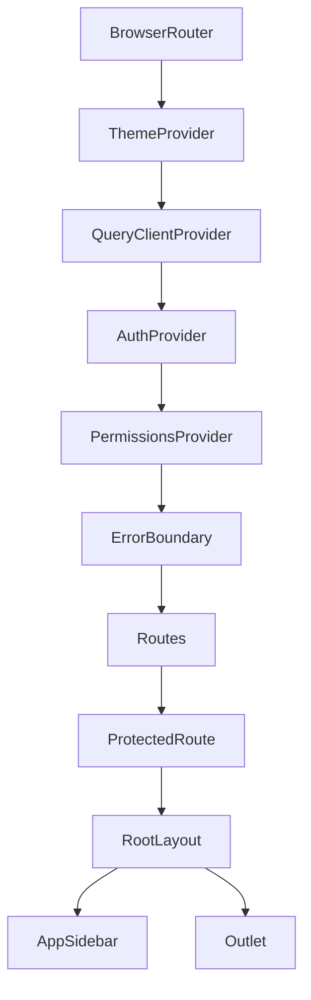
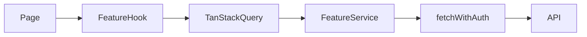

# Frontend Architecture

## Responsibilities

`spa-velocity` is the browser application for Velocity. It owns:

- authentication and account lifecycle screens;
- permission-aware navigation and route composition;
- organization context selection;
- administration workflows;
- project and source configuration;
- streamed chat rendering;
- local interaction state and server-state caching.

It does not own credentials, authorization decisions, source retrieval, SQL
execution, vector ingestion, or LLM orchestration. Those remain in
`api-velocity`.

## Technology Stack

| Concern | Implementation |
|---|---|
| Language | TypeScript |
| UI runtime | React 19 |
| Build tool | Vite 7 |
| Routing | React Router 7 |
| Server state | TanStack Query 5 |
| Shared client state | Zustand 5 with Immer |
| Forms | React Hook Form and Zod |
| Styling | Tailwind CSS 4 |
| UI primitives | Radix UI, CVA, shadcn-style components |
| Auth client | Better Auth |
| Notifications | Sonner |
| Charts | Recharts |
| Markdown | React Markdown and remark-gfm |
| Unit/component tests | Vitest and Testing Library |
| End-to-end tests | Playwright |

## Runtime Composition



`AppRoutes.tsx` is the composition root. The provider order matters:

1. theme state is available to the whole app;
2. TanStack Query is available to auth and feature hooks;
3. auth resolves the effective session and approval state;
4. permissions resolve for the user and active organization;
5. route content renders only after the access context is ready.

## Source Layout

```text
src/
├── app/
│   ├── main.tsx
│   ├── styles/
│   └── views/
├── features/
│   ├── Admin/
│   ├── AdminDashboard/
│   ├── Airweave/
│   ├── Auth/
│   ├── Chat/
│   ├── Dashboard/
│   ├── Projects/
│   ├── SqlConnections/
│   └── VectorDb/
├── shared/
│   ├── components/
│   ├── context/
│   ├── hooks/
│   ├── lib/
│   ├── store/
│   └── utils/
└── test/
```

Feature folders own their pages, components, hooks, service clients, schemas,
and types. Shared code is reserved for behavior used by multiple features.

## Route Model

### Public account routes

- `/login`
- `/signup`
- `/verify-email`
- `/forgot-password`
- `/set-new-password`
- `/accept-invitation/:invitationId`
- `/pending-approval`
- `/account-rejected`

### Protected product routes

| Route | Permission |
|---|---|
| `/chat` and `/chat/:conversationId` | `chat:read` |
| `/projects` | `project:read` |
| `/collections` and `/collections/:collectionReadableId` | `airweave:read` |
| `/sql-connections` | `sql-connection:read` |
| `/vector-dbs` | `vector-db:read` |
| `/admin/dashboard` | `dashboard:view` |
| `/admin/users` | `user:read` |
| `/admin/sessions` | `session:read` |
| `/admin/organizations` | `organization:read` |
| `/admin/roles` | `role:read` |

`/settings` and `/account` require an approved authenticated session but no
additional domain permission. `/` redirects to `/chat`; unmatched routes
redirect to `/`. The legacy `/admin/airweave` routes redirect to the
corresponding `/collections` route.

`ProtectedRoute` enforces authentication and account status. `AdminRoute`
enforces the requested permission and redirects to a safe fallback. The sidebar
uses the same `can(resource, action)` function to hide inaccessible
destinations.

These client checks improve the experience but are not the security boundary.
The API independently enforces permissions and organization scope.

## Authentication

The Better Auth browser client:

- points to `VITE_API_URL`;
- uses organization and admin plugins;
- reads the `set-auth-token` response header after successful auth;
- stores the token as `localStorage["bearer_token"]`;
- sends it as an `Authorization: Bearer` header.

Browser configuration is intentionally small:

| Variable | Purpose |
|---|---|
| `VITE_API_URL` | Better Auth, REST, and SSE API base URL |
| `VITE_AIRWEAVE_CONNECT_URL` | Optional Airweave Connect SDK endpoint; validated as HTTPS, except `http://localhost` in development |

Both values are public build-time configuration. Secrets must remain in the
backend environment.

`fetchWithAuth` intentionally defaults to `credentials: "omit"` so a stale
session cookie cannot override the effective bearer session, particularly
during impersonation.

### Frontend security posture

The bearer-first design avoids mixed cookie/bearer session resolution, but
local storage is readable by JavaScript executing in the page. An XSS defect or
compromised frontend dependency could therefore expose the active token and,
during impersonation, the original administrator token.

The repository provides a strict referrer policy but does not define a
production Content Security Policy or hosting-layer security headers. Before a
production rollout, the deployment owner should:

- define and test a restrictive CSP at the CDN or web-server layer;
- restrict script, frame, connection, and image origins to required providers;
- review every raw-HTML or dynamic-style sink and third-party browser package;
- verify token clearing on logout, expiry, impersonation exit, and auth errors;
- run browser security and dependency scanning in CI;
- decide whether the localStorage bearer model is acceptable for the target
  threat and compliance profile.

Browser permission checks remain a user-experience control. API authorization
is the security boundary.

`AuthContext` combines:

- the Better Auth session;
- the dedicated approval-status endpoint;
- login, signup, logout, verification, and password-reset operations;
- a normalized platform role.

## Authorization and Organization Context

`PermissionsContext` fetches `/api/rbac/my-permissions` with a query key scoped
by user and active organization. It exposes:

```ts
can(resource, action): boolean
```

The effective permission set changes when the organization changes. Previous
data remains visible during the refetch to avoid unmounting active screens.

Shared hooks derive:

- the effective session;
- platform and organization role;
- active organization;
- superadmin and manager capabilities;
- impersonation state;
- cross-organization viewing scope.

## State Management

Velocity separates state by ownership:

| State | Location |
|---|---|
| Input, dialog, selection, and display state | Component-local React state |
| Shared UI state | Lifted to the nearest common owner |
| Server resources | TanStack Query |
| App-wide client-only state | Zustand |
| Auth/session | Better Auth plus AuthContext |
| Permissions | TanStack Query plus PermissionsContext |

The global Zustand store is intentionally small. Server records do not belong
in it because TanStack Query owns caching, invalidation, loading, and errors.

## API Service Pattern

Feature services build REST requests and use `fetchWithAuth`. Feature hooks wrap
those services with TanStack Query.



Mutation hooks invalidate namespaced query keys. Errors propagate to pages or
dialogs and are shown through inline states or Sonner toasts.

## Chat Streaming

The chat service sends a POST request to the SSE endpoint and parses event
frames from the response stream.

Supported frontend event handling includes:

- `start`: add the user message and conversation state;
- `thinking`: show reasoning progress;
- `searching`: show retrieval progress;
- `chunk`: append answer text;
- `sql_executed`: add a structured SQL execution card;
- `complete`: replace optimistic state with persisted API state;
- `error`: stop streaming and surface the failure.

The backend agent domain also defines SQL planning/executing progress events,
but the current chat controller does not forward them over SSE and the SPA does
not render them. `sql_executed` is the current public progress event for the SQL
path.

## UI System

Shared primitives under `src/shared/components/ui/` wrap Radix UI and Tailwind.
CVA defines variants, while `cn()` combines `clsx` and `tailwind-merge`.

Accessibility behavior comes primarily from:

- semantic elements and labels;
- Radix focus and keyboard behavior;
- route and dialog focus management;
- Testing Library queries by role and label;
- Playwright coverage for navigation and guarded workflows.

## Feature Boundaries

### Chat

Owns conversations, messages, project selection, SSE state, source rendering,
SQL call rendering, and responsive conversation navigation.

### Projects

Owns project CRUD and source attachment. Source types are discriminated unions:
Airweave collection, database, vector database, and reserved external source.

### Airweave

Owns collection and source-connection workflows, including catalog/OAuth
integration through `@airweave/connect-react`.

### SQL Connections

Reuses the organization SQL connection manager as a first-class page. Secrets
are submitted to the API but never returned in public response objects.

### Vector Databases

Owns vector database CRUD, file upload, status display, and ingestion job
presentation. Page-level create, rename, upload, and database-delete actions are
permission-gated. The document dialog currently renders file deletion to users
who can open the upload workflow even when they lack `vector-db:delete`; the API
still rejects the request. Aligning that control with the delete permission is
a known frontend gap.

### Admin

Owns users, sessions, organizations, memberships, invitations, roles,
permissions, approval, banning, and impersonation.

## Testing Strategy

- Co-located Vitest tests cover hooks, components, contexts, services, and
  utilities.
- Testing Library exercises behavior through roles and labels.
- Playwright suites are grouped by Auth, RBAC, Chat, Projects, Airweave,
  Dashboard, shared navigation, SQL connections, and API smoke checks.
- Playwright uses one worker and no retries to preserve deterministic database
  isolation.

```bash
npm test
npm run test:e2e:smoke
npm run test:e2e:full
```

## Extension Guidelines

When adding a frontend capability:

1. place it in an existing feature or create a cohesive feature folder;
2. add the API service and namespaced TanStack Query hooks;
3. add the route in `AppRoutes.tsx`;
4. add permission-filtered navigation if it is a primary destination;
5. reuse shared Radix-based primitives;
6. cover service, hook, component, and end-to-end behavior at the appropriate
   layers;
7. update this documentation when the capability changes the product model.
