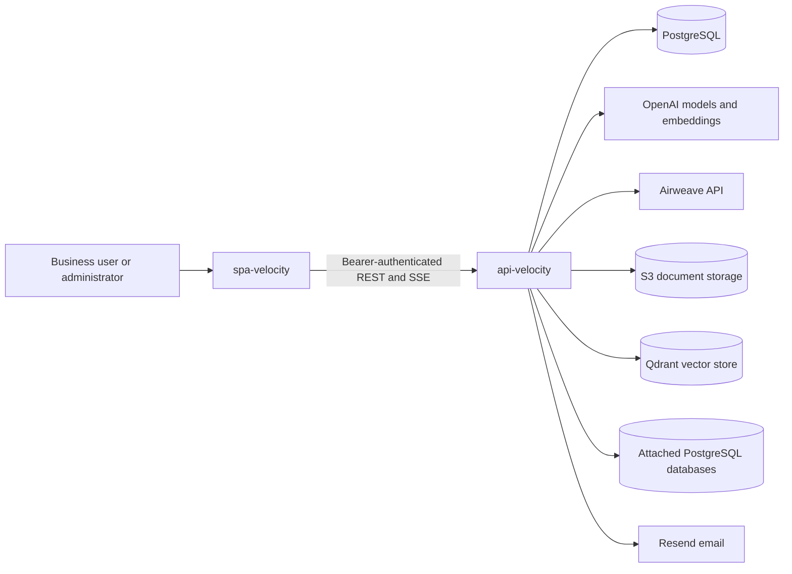
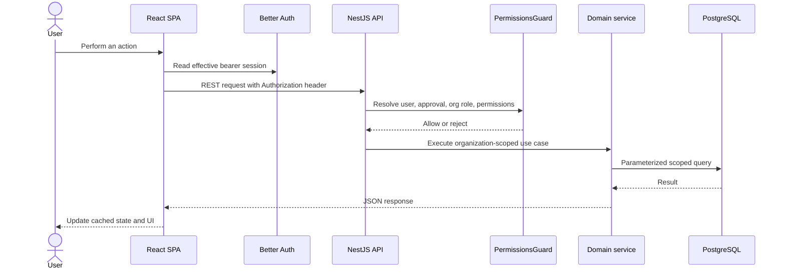
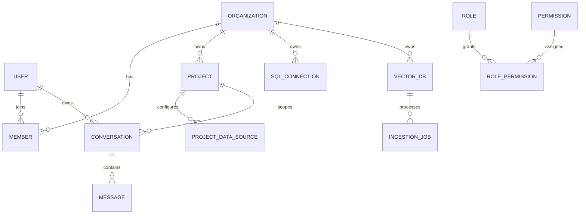
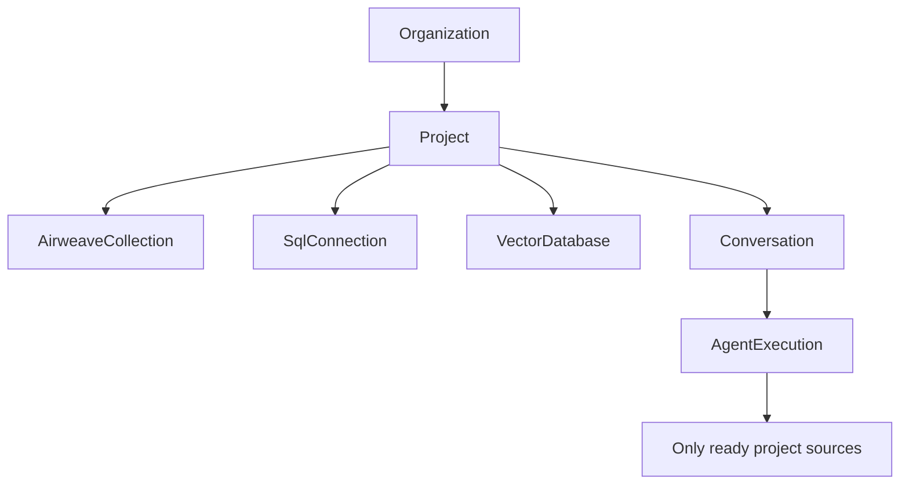
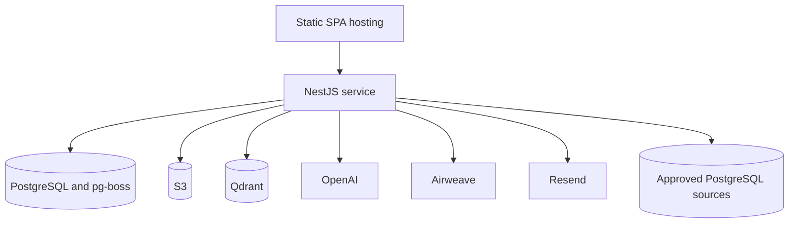

# Velocity Workspace Architecture

## Repository Topology

Velocity is split into two sibling repositories:

```text
spa-velocity/  React browser application
api-velocity/  NestJS API, persistence, integrations, and agent runtime
```

The repositories are independently built and tested but form one product.

## System Context



## Responsibility Split

| Concern | Frontend | Backend |
|---|---|---|
| Login and account UI | Yes | Auth execution and session persistence |
| Navigation and route guards | UX enforcement | Authoritative permission enforcement |
| Active organization selection | Captures user context | Validates scope and ownership |
| Projects and source forms | Yes | Validation, persistence, and source resolution |
| Chat presentation | SSE parsing and rendering | Routing, tools, LLMs, persistence |
| SQL execution | Displays metadata | Decryption, safety checks, execution, shaping |
| Document ingestion | Upload and status UI | S3, queue, extraction, embedding, Qdrant |
| Airweave | Management UI | SDK access and ownership checks |
| Secrets | Never stored as frontend config | Server environment and encrypted persistence |

## End-to-End Request Flow



## Core Domain Model



Airweave collections live in Airweave. Velocity records organization ownership
through an allowlist in organization metadata rather than duplicating the
collection record locally.

## Project as the Context Boundary

The project is the central product abstraction:



This boundary provides:

- an explicit set of sources available to a conversation;
- organization ownership checks;
- a place to add future source providers;
- reproducible conversation context.

## Security Boundaries

### Browser to API

- Bearer tokens are issued by Better Auth.
- The browser stores the token in local storage and sends it in the
  `Authorization` header.
- The browser omits cookies on direct API requests to avoid mixed-session
  behavior.
- Browser permission checks are advisory UX; API guards are authoritative.

### Tenant isolation

- Most domain records carry `organization_id`.
- Controllers resolve the requested or active organization.
- Services reject cross-organization requests.
- Repositories include organization scope in reads and writes.
- Superadmin cross-organization behavior is explicit rather than implicit.
- Airweave collection lists are allowlist-filtered, but direct-read ownership
  enforcement is feature-flagged and defaults to observe-only in production
  until `AIRWEAVE_READ_LOCKDOWN_ENFORCE=true`.

### Source credentials

- Airweave and OpenAI keys remain server-side.
- SQL passwords are encrypted with AES-256-GCM.
- Vector source files are stored in S3.
- No secret belongs in a `VITE_*` variable.

### Agent execution

- Only ready project sources are exposed to the agent.
- SQL tools resolve connections inside the active organization.
- SQL execution is restricted to read-only statement classes and a
  read-only transaction.
- Host validation blocks private, loopback, link-local, and metadata ranges.
- Result size, field size, SQL length, connection pool, and timeout limits are
  enforced.
- Browser disconnects abort in-flight tool work.

## Deployment Shape

Minimum full-feature infrastructure:



The current API constructs every module at startup. A running deployment
therefore requires PostgreSQL, the SQL credential-encryption key, OpenAI, S3,
and Qdrant configuration even if some vector database screens are not exposed
to users. Resend and Airweave remain optional integrations. SQL chat additionally
requires reachable PostgreSQL sources with least-privilege credentials.

## Quality Attribute Assessment

| Attribute | Current position | Decision or gap |
|---|---|---|
| Security | API-enforced permissions, organization predicates, encrypted SQL credentials, SQL read-only controls | Airweave direct-read lockdown defaults to observe-only in production; there is no database row-level security, durable audit subsystem, or repository-managed frontend CSP |
| Reliability | Persistent application data, pg-boss jobs, ingestion reconciliation, abortable chat | No contractual SLO, dependency-aware readiness, tested recovery objective, or complete orphan reconciliation |
| Scalability | Stateless REST/SSE paths and PostgreSQL-coordinated queue work support multiple API instances | Rate limits are process-local, every API instance starts workers, and startup migrations need deployment serialization |
| Observability | Operational logs include agent route, duration, tool, source, SQL, and ingestion context; a synthetic 100-question RAG benchmark provides an initial answer/retrieval/latency baseline | No request IDs, metrics exporter, distributed tracing, complete LLM/sub-agent cost ledger, or customer-domain release gate |
| Data governance | Organization ownership, source readiness, project boundaries, encrypted connection credentials | Retention, legal hold, data residency, provider processing terms, and complete deletion policy are deployment decisions |
| Maintainability | Feature/domain modules, ports and adapters, architecture decisions, broad automated tests | Public API versioning and cross-repository release compatibility are not formalized |
| Portability | Provider boundaries isolate Airweave, Qdrant, S3, OpenAI, and PostgreSQL details | Current startup and agent implementation still require specific providers and PostgreSQL |

This assessment is intentionally conservative. A design can be technically
sound for a pilot while still needing explicit operational and governance
decisions before enterprise production use.

See [Executive and architecture review](executive-architecture-review.md) for
the ranked objections and go-live gates.

## Development Workflow

Each repository has its own package manifest, test suite, architecture
decisions, and coding-agent guidance. Run commands from the target repository:

```bash
# frontend
cd spa-velocity
npm test
npm run build

# backend
cd ../api-velocity
npm test
npm run test:e2e
npm run build
```

Cross-repository changes should preserve the REST/SSE contracts and be
documented from both perspectives. Backend ADR numbers and frontend ADR numbers
are independent and must be qualified when discussed in the same document.
